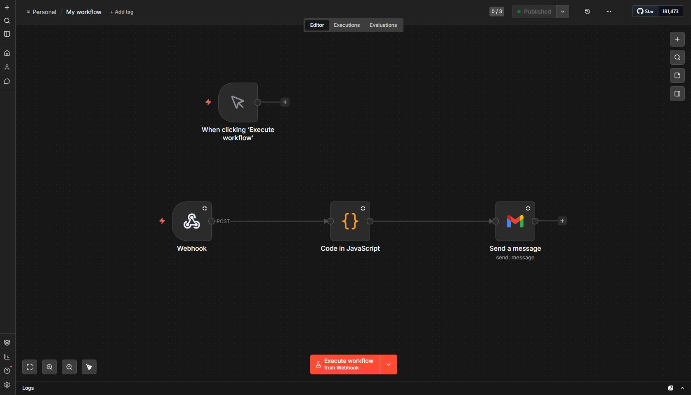

# SafetyScanAI: Real-Time Industrial Safety & Compliance System

SafetyScanAI is a high-performance, distributed monitoring solution designed to automate safety audits in construction and manufacturing environments. By combining Computer Vision (YOLOv11) with Generative AI (RAG & Multi-Agent Orchestration), the system doesn't just detect violations—it interprets them against official safety manuals and automates the reporting pipeline.

---
## Overall Project Workflow
1. **Ingestion:** User uploads an image via the dashboard
2. **Detection:** Image is tunneled to Colab where YOLO identifies PPE status.
3. **Verification:** CLIP compares the image against a library of past violations to confirm.
4. **Enrichment:** RAG retrieves relevant OSHA legal snippets from a local PDF.
5. **Audit:** CrewAI agents coordinate to write and verify a professional compliance report.
6. **Notification:** Results are broadcast back to the dashboard and pushed to n8n
(Docker) for automated email delivery

---

## Key Features
* **Vision Core:** Custom-trained YOLO model for PPE detection (Helmets, Vests, etc.).
* **Incident Memory:** CLIP + FAISS vector database for image-to-image similarity searching of past violations.
* **Legal RAG:** LangChain-powered retrieval system indexed with the *Delhi Govt. Construction Safety Manual*.
* **AI Agents:** CrewAI "Safety Auditor" and "Legal Critic" agents for high-fidelity compliance reporting.
* **Automated Workflow:** n8n integration for real-time Gmail alerts to supervisors via Webhooks.

---

## System Architecture
The project follows a **Distributed Microservices Architecture**:
1.  **Colab Backend:** Handles GPU-heavy tasks (Inference, Vector Search, LLM Agents).
2.  **Local FastAPI:** Manages WebSockets, local storage, and bridges the UI to the Cloud.
3.  **n8n:** Handles the logic-based notification workflow via Docker.


---

## Setup Instructions

### 1. AI Backend (Google Colab)
* **Training:** Open `YOLO_training.ipynb`. 
    * Dataset: [Roboflow Construction Safety](https://universe.roboflow.com/roboflow-100/construction-safety-gsnvb).
    * Train for **100 epochs** on classes: `vest`, `no-vest`, `helmet`, `no-helmet`, `person`.
    * Save the resulting `best.pt` into your project's `/models` folder.
* **Inference & RAG:** Open `ai-pipeline.ipynb`.
    * Upload the [Safety Manual PDF](https://labour.delhi.gov.in/sites/default/files/Labour/important-news/safety_manual_for_construction_workers.pdf) to the `/knowledge_base` directory.
    * Upload 10-15 violation reference images to the `/violations` directory.
    * Run all cells and copy the **Ngrok Public URL** generated at the end.

### 2. Local Backend (FastAPI)
* Navigate to the project root and create a `.env` file:
    ```env
    COLAB_API_URL=your_ngrok_url_here
    N8N_WEBHOOK_URL=http://localhost:5678/webhook/safety-alert
    API_SECRET_KEY=your_chosen_secret
    ```
* Install dependencies: `pip install -r requirements.txt`
* Start the server: `uvicorn app:app --reload`

### 3. Automation (n8n & Docker)
* Spin up your n8n instance using Docker.
* **Workflow Logic:**
    1.  **Webhook Node:** Listens for POST requests from the FastAPI backend.
       
    3.  **Code Node:** Formats the AI-generated report and image.
  
    4.  **Gmail Node:** Sends the compliance report to the designated authority.
    

       
* Use **Ngrok** to tunnel port `5678` if your n8n instance needs to be accessible globally.

---

## Frontend Usage
1.  Open your browser to `http://localhost:8000`.
2.  The dashboard will show a real-time feed or allow image uploads.
3.  When a violation is detected:
    * A card pops up instantly via **WebSockets**.
    * The RAG system cites the specific safety rule violated.
    * An email is dispatched automatically via n8n.

---

## Tech Stack
* **AI/ML:** YOLO, CLIP, FAISS, CrewAI
* **Backend:** FastAPI (Python), LangChain
* **Frontend:** HTML5, Tailwind CSS, JavaScript
* **DevOps:** Docker, Ngrok, n8n
